# FoodFlow Web

FoodFlow Web is a Deliveroo-inspired food ordering frontend built with React, TypeScript, Vite, MUI, Redux Toolkit, Stripe Elements, and Sonner. It talks to a Backend-for-Frontend (BFF) gateway instead of calling individual backend services directly.

This project is an educational portfolio app. It is not affiliated with Deliveroo.

## What This App Does

- Browse restaurants and filter/search available restaurants.
- View restaurant menu pages with category navigation, special offers, popular dishes, dish detail dialogs, restaurant info, reviews, and in-restaurant search.
- Add dishes to a cart with single-restaurant cart protection.
- Use responsive cart experiences: sidebar cart on desktop and bottom drawer cart on mobile.
- Sign up, log in, persist sessions, and protect account/checkout routes.
- Manage profile details, saved addresses, order history, and saved payment methods.
- Place cash-on-delivery orders.
- Create card payment orders, confirm payment with Stripe, and redirect only after successful payment.
- View order confirmation and order history.
- Show skeleton loading states for restaurant info, categories, and menu content.
- Use Sonner toast notifications for success/error feedback.
- Use a role-aware restaurant workspace for dashboard, orders, menu, analytics, settings, and team management.
- Invite restaurant employees, finance users, and administrators without sharing credentials.

## System Context

The frontend calls only the BFF gateway.



```text
React Web App
  -> BFF Gateway
    -> Auth Service
    -> Restaurant Service
    -> Order Service
    -> Payment Service
    -> Notification Service via backend events
```

The browser must not call internal microservices directly. The BFF owns request routing, public API key checks, JWT forwarding, and service-to-service headers.

## Related Repositories

Expected local service folders:

```text
/Users/diludevx/projects/node/deliveroo-clone-api
/Users/diludevx/projects/node/deliveroo-clone-auth-service
/Users/diludevx/projects/node/deliveroo-clone-restaurant-service
/Users/diludevx/projects/node/deliveroo-clone-order-service
/Users/diludevx/projects/node/deliveroo-clone-payment-service
/Users/diludevx/projects/node/deliveroo-clone-notification-service
```

The frontend can run against either:

- A local BFF, usually `http://localhost:3000`
- The deployed dev BFF, currently exposed through HTTPS by Caddy on the Azure VM

## Tech Stack

- React 18
- TypeScript
- Vite
- MUI
- Redux Toolkit
- Redux Persist
- React Router
- React Hook Form
- Zod
- Axios
- Stripe Elements
- Sonner
- Vitest and Testing Library
- ESLint and Prettier
- Semantic Release

## Project Structure

```text
src/
  assets/          Static images and SVGs
  components/      Shared UI components
  config/          Client-side configuration helpers
  data/            Legacy static types/data used by menu views
  features/
    menu/          Restaurant, menu, cart, payment form, and menu UI modules
  hocs/            Route guards and higher-order wrappers
  layout/          Shared layout components
  pages/           Route-level pages
  services/        BFF API clients and feature service wrappers
  store/           Redux slices, thunks, hooks, and store setup
  theme/           Colors, images, SVG paths, spacing, font sizes
  types/           Shared frontend types
  utils/           Notifications and helper utilities
tests/             Vitest tests and setup
```

## Environment Variables

Create `.env` from `.env.example`.

```env
VITE_BFF_API_URL=http://localhost:3000
VITE_BFF_API_KEY=your-bff-api-key

VITE_STRIPE_PUBLISHABLE_KEY=pk_test_your_stripe_publishable_key

VITE_FIREBASE_API_KEY=your_firebase_api_key
VITE_FIREBASE_AUTH_DOMAIN=your_firebase_auth_domain
VITE_FIREBASE_PROJECT_ID=your_firebase_project_id
VITE_FIREBASE_STORAGE_BUCKET=your_firebase_storage_bucket
VITE_FIREBASE_MESSAGING_SENDER_ID=your_firebase_messaging_sender_id
VITE_FIREBASE_APP_ID=your_firebase_app_id
```

Important notes:

- `VITE_BFF_API_URL` must include the public BFF origin, not an internal service URL.
- `VITE_BFF_API_KEY` is a public client key for the BFF. It is not a replacement for JWT auth.
- `VITE_STRIPE_PUBLISHABLE_KEY` must be the Stripe publishable key. Never put the Stripe secret key in the frontend.
- Firebase config is only client config. Do not put privileged Firebase secrets here.

## Local Setup

Install dependencies:

```bash
npm install
```

Start the frontend:

```bash
npm run dev
```

Open:

```text
http://localhost:5173
```

The BFF must also be running and reachable at `VITE_BFF_API_URL`.

## Scripts

```bash
npm run dev             # Start Vite dev server
npm run build           # Type-check project references and build production bundle
npm run preview         # Preview production build
npm run types:check     # Run TypeScript without emitting files
npm run lint:check      # Run ESLint
npm run lint:fix        # Fix ESLint issues in src
npm run format:check    # Check Prettier formatting
npm run format:fix      # Format files with Prettier
npm run test:run        # Run Vitest once
npm run release         # Run semantic-release
npm run release:dry-run # Preview semantic-release output
```

## Core Flows

### Authentication

The app authenticates through the BFF/auth service. JWTs are stored client-side and attached to authenticated BFF requests. Protected routes wait for auth initialization before deciding whether to render or redirect.

### Restaurant Workspace

Restaurant navigation and routes are capability-driven:

- `employee`: dashboard and orders
- `finance`: dashboard and analytics
- `admin`: dashboard, orders, menu, analytics, settings, and team management
- `super_admin`: owner access to the same workspace plus broader role assignment
- Platform admins create a restaurant and its initial `super_admin` through one retry-safe BFF
  provisioning command. Owners continue to invite later `admin`, `finance`, and `employee` staff
  through the existing team workflow.

Team members join through an expiring email link and set or confirm their own
password. The frontend hides inaccessible actions, while the BFF and owning
services enforce the same permissions independently.

### Restaurant And Menu

Restaurant list, restaurant details, categories, dishes, popular dishes, and special-offer dishes come from the restaurant service through the BFF. The menu page renders:

- Restaurant info skeleton while loading
- Category skeleton while loading
- Menu skeleton while dishes/categories resolve
- Special offers from `discountPercent`
- Popular dishes from `isPopular`
- Dish detail dialog for full dish data
- Restaurant info and review dialogs
- In-restaurant search overlay

### Cart

The cart is owned by the order service. The frontend keeps Redux state for UI responsiveness, then syncs through the BFF. Cart rules:

- A cart belongs to one restaurant at a time.
- Adding from another restaurant asks the user before replacing the cart.
- Logged-out users can build a local cart.
- Logged-in users sync cart state with the backend.

### Checkout

Checkout uses server-side pricing. The frontend must not be treated as a trusted source for dish names, item prices, delivery fees, service fees, or totals.

For delivery orders, users can:

- Use a saved address
- Add a new address
- Save a new address for future use

Cash-on-delivery orders go to an order confirmation page after successful checkout.

### Card Payments

Card orders use Stripe through the payment service.

The expected flow:

1. Checkout creates a pending order through the order service.
2. Payment page asks the order service/payment service to create or reuse a PaymentIntent.
3. Stripe Elements confirms the card payment.
4. Stripe webhook updates backend payment/order state.
5. The frontend redirects to order confirmation only after payment succeeds.

The frontend only sends payment-intent requests with trusted identifiers such as `orderId` and optional expected total checks. It must not calculate the final Stripe amount.

## Testing

Run the current frontend test suite:

```bash
npm run test:run
```

Run the usual verification set before merging:

```bash
npm run types:check
npm run lint:check
npm run build
```

Useful test areas:

- Auth headers
- Protected routes
- Payment page lifecycle
- Checkout and cart behavior

## Deployment

The frontend is deployed separately from the backend services. The current dev deployment target is Azure Static Web Apps.

The deployed frontend should use:

```env
VITE_BFF_API_URL=https://your-bff-domain.example.com/api
VITE_BFF_API_KEY=your-public-bff-key
VITE_STRIPE_PUBLISHABLE_KEY=pk_test_or_live_key
```

Deployment checklist:

- BFF CORS allows the frontend origin.
- Stripe publishable key matches the Stripe environment used by the payment service.
- The BFF URL uses HTTPS to avoid mixed-content browser blocking.
- Cloud asset domains allow the frontend origin through CORS if images/SVGs are loaded cross-origin.

## Current Engineering Notes

- Keep frontend requests routed through the BFF.
- Do not add internal service API keys to browser requests.
- Do not trust frontend totals for checkout or payment.
- Prefer skeletons over empty states while restaurant/menu data is still loading.
- Repeated images should use lazy loading unless they are first-viewport hero assets.
- Keep mobile and desktop layouts using stable dimensions to avoid layout shifts.

## License

Educational portfolio project.

## Author

**DiluDevX**

- GitHub: [@DiluDevX](https://github.com/DiluDevX)
